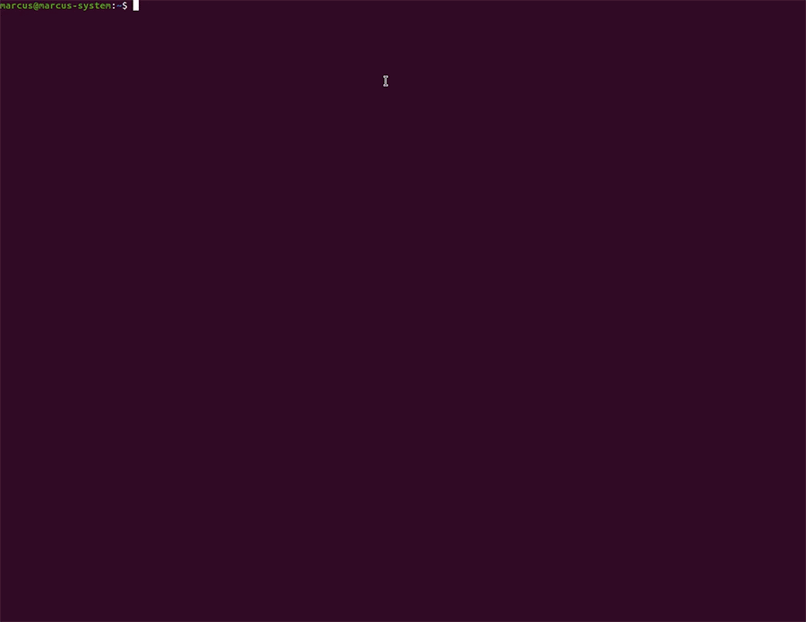

<p align="center">
  
</p>
<p align="center">Managing appointments in barbershops builting React Native Typescript and Styled Components.</p>

## Installation

You may clone this repository.

```
  git clone git@github.com:marcuspereiradev/appgobarber.git
```

<p>Have an Android emulator running (quickest way to get started), or a device connected.</p>
<p>I usually use [Android Studio](https://developer.android.com/studio) emulator.</p>
<p>[React Native Environment](https://react-native.rocketseat.dev/) with [Android Studio](https://developer.android.com/studio)</p>

<p align="center">
  
</p>

Inside the created directory run the scripts in order to execute the application.

```
  // Install the dependencies
  npx react-native run-android
```

```
  // Start the application
  yarn start
```

## License
This project is under MIT license. See the archive [LICENSE](./LICENSE) to more details.

## Authors

|  [Marcus Pereira](https://github.com/marcuspereiradev)   |
