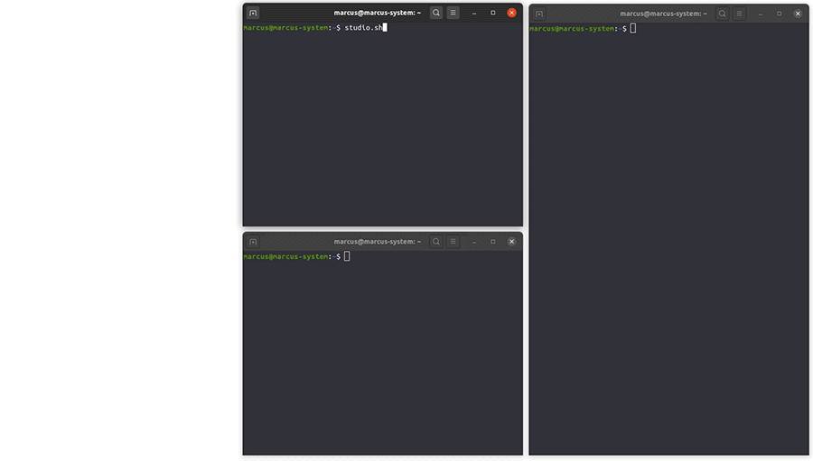
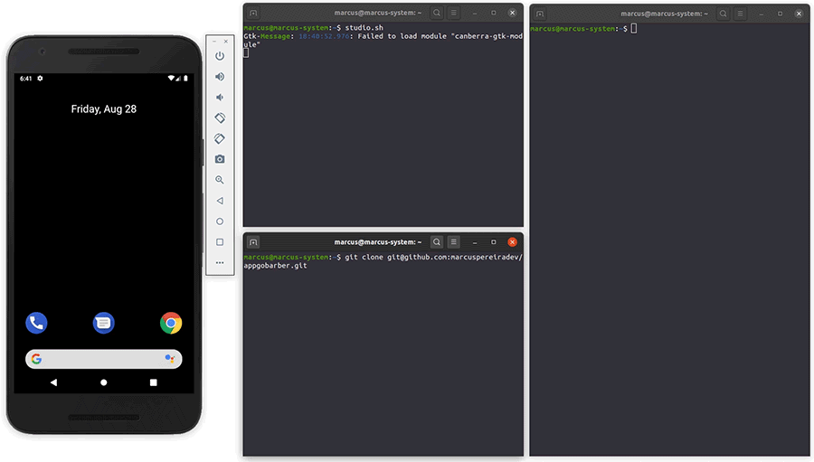
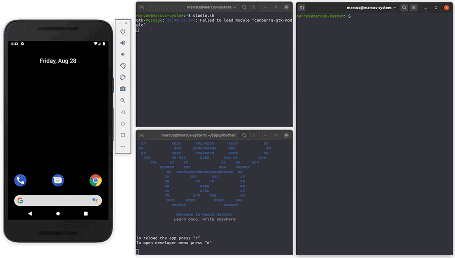

<p align="center">
  
</p>

<p align="center">Managing appointments in barbershops builting React Native, Typescript and Styled Components.</p>

## Features

<p align="center">
  
</p>

## Installation

Have an Android emulator running (quickest way to get started), or a device connected. </br>
I usually use [Android Studio](https://developer.android.com/studio) emulator. </br>
[React Native Environment with Android Studio](https://react-native.rocketseat.dev/)

<p align="center">
  
</p>

You may clone this repository.

```
  git clone git@github.com:marcuspereiradev/appgobarber.git
```

<p align="center">
  
</p>

Inside the created directory run the scripts in order to execute the application.

```
  // Install the dependencies
  yarn install
```

<p align="center">
  
</p>

```
  // Start the application
  yarn start
```

<p align="center">
  
</p>

```
  // Compiling the application
  npx react-native run-android
```

<p align="center">
  
</p>

## License

This project is under MIT license. See the archive [LICENSE](./LICENSE) to more details.

## Authors

| [Marcus Pereira](https://github.com/marcuspereiradev) |
